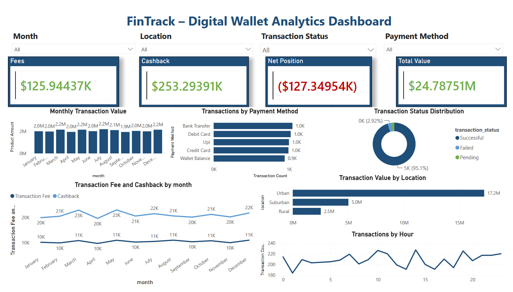
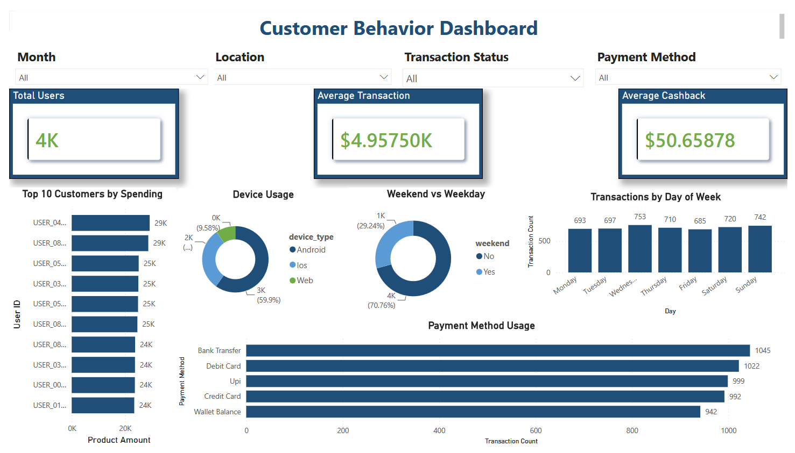
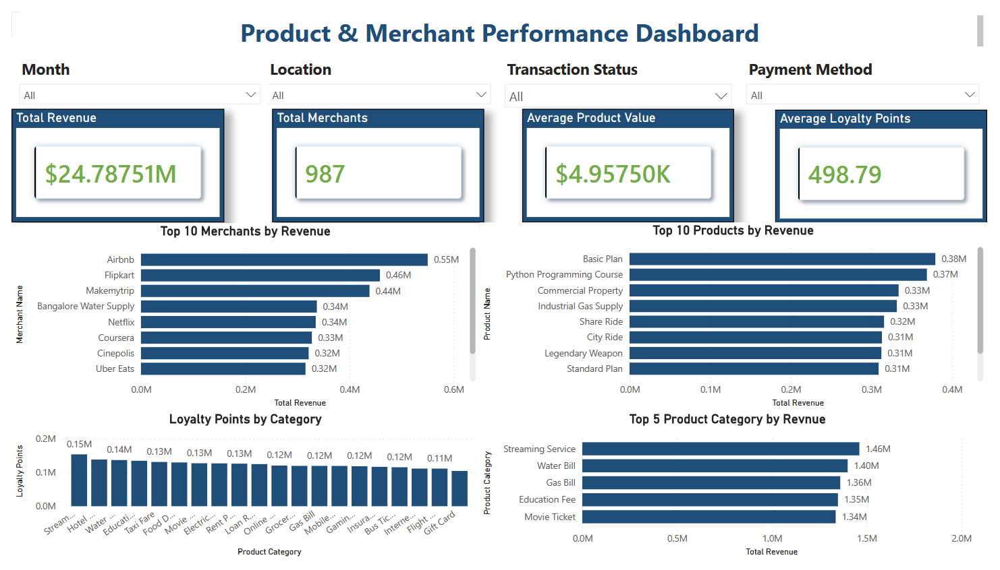
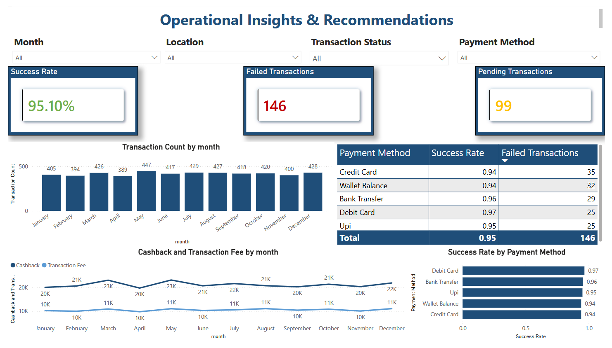
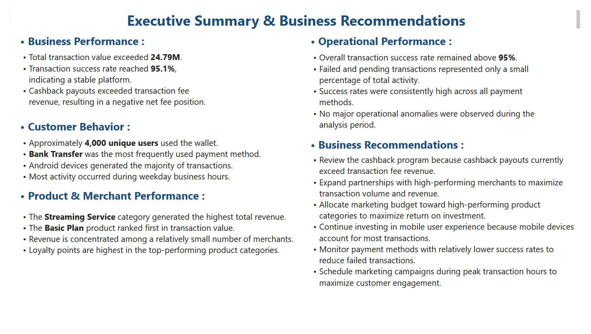

# 💳 FinTrack – Digital Wallet Analytics Dashboard


An end-to-end Data Analytics project that analyzes digital wallet transaction data to uncover business insights, customer behavior, product performance, and operational efficiency.

This project demonstrates the complete analytics workflow—from raw data preprocessing in Python, to SQL database management, and finally to interactive dashboards built with Power BI.

---

## 📌 Project Overview

Digital wallets have become one of the fastest-growing payment methods in the fintech industry. Understanding transaction patterns, customer behavior, and operational performance is essential for improving user experience and maximizing business revenue.

In this project, a digital wallet transaction dataset was analyzed to answer important business questions such as:

- Which payment methods are used most frequently?
- Which product categories generate the highest revenue?
- Which merchants contribute the most transaction value?
- How successful are transactions overall?
- Is the cashback program financially sustainable?
- What operational improvements can be made?

The project concludes with business recommendations supported by data-driven insights.

---

## 🎯 Project Objectives

- Clean and prepare raw transaction data
- Perform Exploratory Data Analysis (EDA)
- Store and query data using MySQL
- Build interactive Power BI dashboards
- Identify customer behavior patterns
- Analyze product and merchant performance
- Evaluate operational efficiency
- Generate actionable business recommendations

---

# 🛠️ Technologies Used

| Tool | Purpose |
|------|---------|
| Python | Data Cleaning & Exploratory Data Analysis |
| Pandas | Data Manipulation |
| NumPy | Numerical Operations |
| Matplotlib | Data Visualization |
| MySQL | Data Storage & SQL Analysis |
| Power BI | Interactive Dashboard Development |
| Git & GitHub | Version Control |

---

# 📂 Dataset

**Source**

Digital Wallet Transactions Dataset (Kaggle)

The dataset contains digital wallet transaction records including:

- Transaction ID
- User ID
- Transaction Date
- Product Category
- Product Name
- Merchant Name
- Transaction Amount
- Transaction Fee
- Cashback
- Loyalty Points
- Payment Method
- Transaction Status
- Device Type
- Location

---

# 🔄 Project Workflow

```
Raw Dataset
      │
      ▼
Python
(Data Cleaning & Feature Engineering)
      │
      ▼
Exploratory Data Analysis (EDA)
      │
      ▼
Cleaned CSV
      │
      ▼
MySQL Database
(Data Storage & SQL Queries)
      │
      ▼
Power BI
(Interactive Dashboards)
      │
      ▼
Business Insights
      │
      ▼
Recommendations
```

---

# 🧹 Data Cleaning

The dataset was cleaned and transformed using Python.

### Cleaning Steps

- Checked for missing values
- Checked duplicate records
- Converted transaction dates to datetime format
- Standardized text values
- Inspected numeric outliers using boxplots

### Feature Engineering

New features were created including:

- Month
- Day Name
- Hour
- Weekend Indicator

---

# 📊 Exploratory Data Analysis

The following analyses were performed:

### Financial Analysis

- Total Transaction Value
- Total Transaction Fees
- Total Cashback
- Net Fee Position

### Transaction Performance

- Transaction Success Rate
- Failed Transactions
- Pending Transactions
- Peak Transaction Hours
- Most Active Days

### Customer Behavior

- Most Used Payment Methods
- Device Usage
- Active Locations
- Customer Segmentation

### Product Performance

- Revenue by Category
- Top Products
- Top Merchants
- Loyalty Points by Category

### Operational Analysis

- Success Rate by Payment Method
- Cashback vs Transaction Amount
- Fee vs Cashback Trend

---

# 🗄️ SQL Analysis

After cleaning, the dataset was imported into MySQL where SQL queries were used to:

- Calculate KPIs
- Aggregate transaction values
- Analyze customer behavior
- Identify top-performing merchants
- Generate business reports

---

# 📈 Power BI Dashboard

The final report contains **5 interactive dashboard pages**.

---

## 1️⃣ Executive Overview

Provides a high-level overview of business performance.

### Highlights

- Total Transaction Value
- Transaction Fees
- Cashback
- Net Fee Position
- Monthly Revenue
- Transaction Status
- Revenue by Location
- Payment Method Distribution



---

## 2️⃣ Customer Behavior Dashboard

Analyzes customer activity and transaction patterns.

### Highlights

- Total Users
- Average Transaction
- Average Cashback
- Device Usage
- Weekend vs Weekday Activity
- Payment Method Usage
- Top Customers
- Transactions by Day



---

## 3️⃣ Product & Merchant Performance

Evaluates products and merchants driving business revenue.

### Highlights

- Total Revenue
- Total Merchants
- Average Product Value
- Loyalty Points
- Revenue by Category
- Top Products
- Top Merchants



---

## 4️⃣ Operational Insights & Recommendations

Measures operational health of the digital wallet.

### Highlights

- Success Rate
- Failed Transactions
- Pending Transactions
- Success Rate by Payment Method
- Monthly Transaction Trend
- Cashback vs Fees



---

## 5️⃣ Executive Summary

Summarizes all findings and provides strategic business recommendations.

### Includes

- Business Performance
- Customer Behavior
- Product Performance
- Operational Performance
- Business Recommendations



---

# 💡 Key Business Insights

- Total transaction value exceeded **24 million**.
- Transaction success rate remained above **95%**, indicating a stable platform.
- Cashback payouts exceeded transaction fee revenue, resulting in a negative net fee position.
- Bank Transfer was the most frequently used payment method.
- Mobile devices accounted for the majority of transactions.
- Revenue was concentrated among a relatively small number of merchants.
- Top-performing product categories generated a significant share of total revenue.

---

# 🚀 Business Recommendations

- Review the cashback program to improve profitability.
- Expand partnerships with high-performing merchants.
- Invest more in top-performing product categories.
- Continue improving the mobile user experience.
- Monitor payment methods with relatively lower success rates.
- Schedule marketing campaigns during peak transaction periods.

---

# 📁 Repository Structure

```
FinTrack-Digital-Wallet-Analytics
│
├── data
│   ├── digital_wallet_transactions.csv
│   └── cleaned_transactions.csv
│
├── notebooks
│   └── Digital_Wallet_Analysis.ipynb
│
├── sql
│   ├── database.sql
│   └── business_queries.sql
│
├── powerbi
│   └── FinTrack_Dashboard.pbix
│
├── images
│   ├── dashboard-page1.png
│   ├── dashboard-page2.png
│   ├── dashboard-page3.png
│   ├── dashboard-page4.png
│   └── dashboard-page5.png
│
└── README.md
```

---

# 🎓 Skills Demonstrated

- Data Cleaning
- Feature Engineering
- Exploratory Data Analysis
- SQL
- Data Visualization
- Dashboard Design
- Business Intelligence
- Data Storytelling
- KPI Development
- Business Recommendation Generation

---

## ⭐ If you found this project helpful, consider giving it a star!